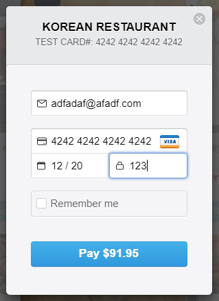

# Real-Time Menu Recommendation and Order Application Based on Weather Change built by React, Node, and MongoDB

## Front-end : React (redux, reduxForm, react-dom, react-router-dom react-bootstrap)
###  - library and API : react-stripe, react-google-maps, react-slick, react-modal, moment
###  - css control : react-bootstrap, wow.js
## Back-end : Node.js (express and mocha)
###  - library : stripe, mongoose, bcrypt
## Database : MongoDB

## Application Concept :
#### Weather always impacts on customer's menu choice in a restaurant. As enclosing this real-time weather information and recommendation menu (Current Specials) based on the weather information, 
#### the application helps customers intuitively choose and order their favorit foods in a bit.

## App Structure :
#### Restaurant Locations
#### Real-Time Weather based on Locations
#### Recommendation Menu based on Preset weather Information
#### Menu Order with Detailed Food Information enclosing Customer's Reviews
#### Guesbooks(containing Customer's Food Evaluation and Recommendation)
#### Login & Guestbook Management (Delete Customer's post)

#### 1. Restaurant Location and Weather Information
####      - displaying local weather information 
####      - updating weather information every 5 minutes 
####      - and utilizing OpenWeatherMap and GoogleMap modules
##### [Toronto Restaurant]
##### 
##### [Vancouver Restaurant]
##### 
#### 2. Recommendatiion Menus  
####      - implementing weather information in the background
####      - updating new recommendation menus every 5 minutes
####      - and plugging in a customized menu recommendation engine built by myself
##### 
#### 3. Menu Detail  
####      - implementing react-bootstrap.modal
####      - implementing customer reviews for each food
####      - including other related menus
##### 
##### 
#### 4. Menu & Order  
####      - to prevent customer from uninentionally clicking an ordering a menu, a checkbox button with a cart icon for customers to ####        select a munu first
####      - dipalying simple and intuitive buttons for the customers to finalize a number of orders
####      - linking to food detail pages which also show customer's reviews and recommendations
##### 
#### 5. Ordering  
####      - Utilizing React-Slick 
####      - applying a screen size to automatically switch the left and right buttons in terms of a number of selected menus        
####      - dipalying simple selected menu for the customers to check out what they just ordered before they palce an order
##### 
#### 6 Estimated Reciept
#####     - displaying estimated billing information 
#####     - and including a function to cancel their choices or to submit their orders
#####     - FYI, Modal is imported to display bill information
##### 
#### 7. Credit Card
#####     - using Strip.js
#####     - implementing credit card input popup window from Strip.js
#####     - In test mode, the card number : 4242 4242 4242 4242
#####       date : any day from today
#####     - CVS : any 3 digit numbers
##### 
#### 8. Customer Survey  
####      - generating a form where the customers can enter their posts about foods and services
####      - enclosing redux-form validation
####      - automatically generating the foods the customers just ordered
####      - and providing email and password inputs that are required for the customers to login and then delete their posts
####      - FYI, bcrypt, mongoose, mlab are implemented in node
##### 
#### 9. Posting Board
#####     - listing the posts all the customers uploaded 
#####     - hiding the "dislike"ed posts for the marketing reason
#####     - and limiting a number of posts to 10 to save time (The customers are able to view whole posts at "menu description", instead.)
#####     - FYI, it works with mlab 
##### 
#### 10. Post
#####     - displaying the previous customer's posts 
#####     - and hiding "Delete" button without user login
##### 
#### 11. Login
#####     - rendering a form where the customers enter email and password to delete their posts 
#####     - and functioning validation about email and password
##### 
#### 12. Individual Customer's Posting Board
#####     - displaying individual customer's posts as they logged in
#####     - FYI, all data are pulled out of mlab through node
##### 
##### 5.2 Customer Post
#####     - displaying a "Delete" button only when the customer logged in 
##### 

